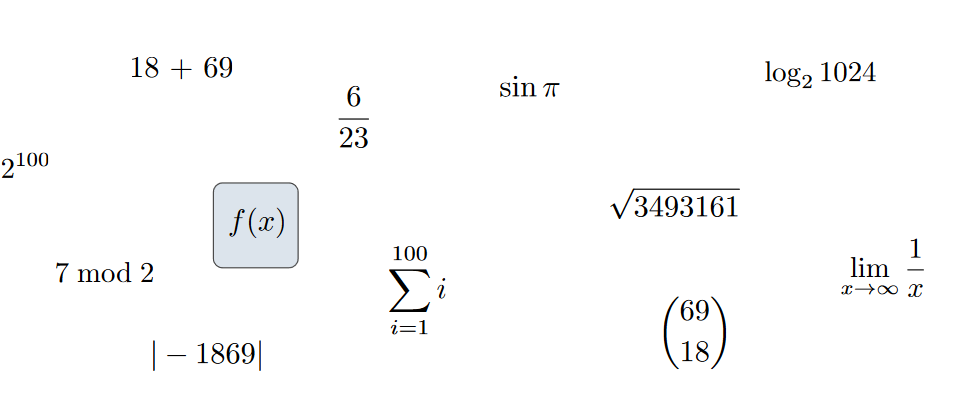
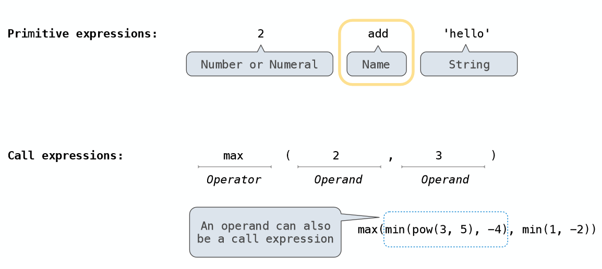
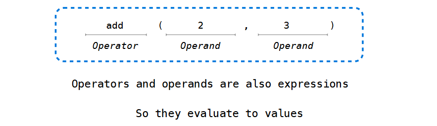
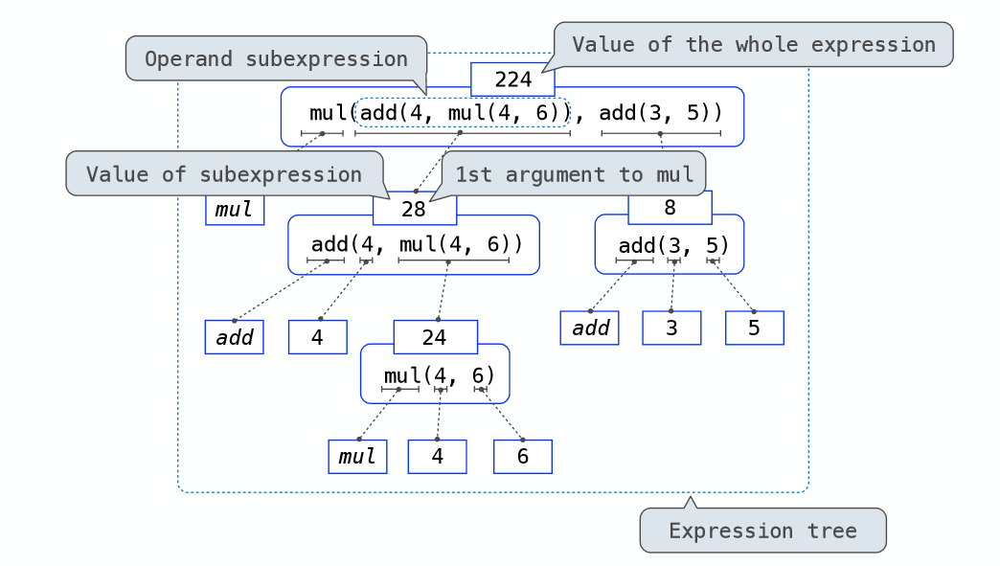

# Expressions

## Types of expressions

An expression describes a computation and evaluates to a value.

All expressions can use function call notation.

## Anatomy of a Call Expression

## Evaluation procedure for call expressions

1. Evaluate the operator and then the operand subexpressions 
2. Apply the function that is the value of the operator 
 to the arguments that are the values of the operands

## Evaluating Nested Expressions

