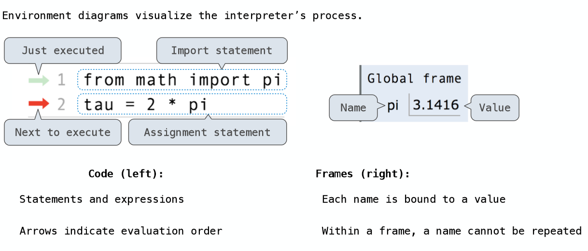
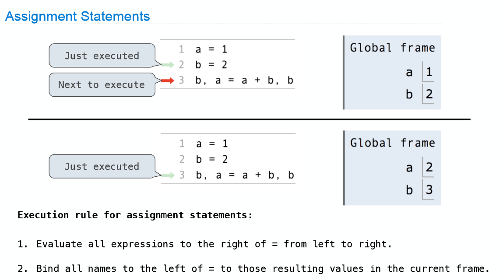
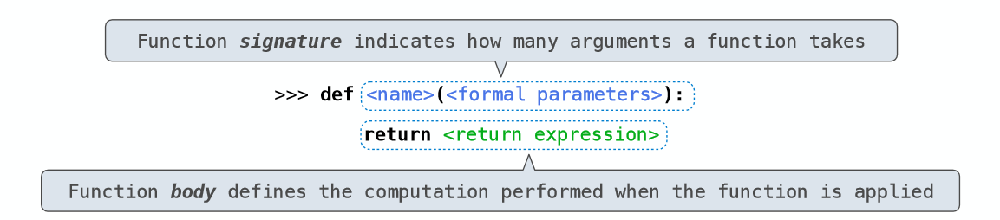
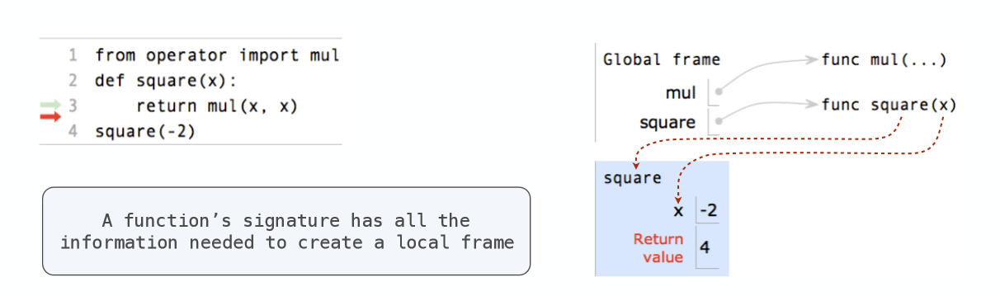

# Names

## Environment Diagram

## Assignment Statements

## Defining Functions

Assignment is a simple means of abstraction: binds names to values 
Function definition is a more powerful means of abstraction: binds names to expressions

**Execution procedure for def statements:** 

1. Create a function with signature <name>(<formal parameters>)
2. Set the body of that function to be everything indented after the first line
3. Bind <name> to that function in the current frame

## Calling User-Defined Functions

**Procedure for calling/applying user-defined functions**

1. Add a local frame, forming a new environment 
2. Bind the function's formal parameters to its arguments in that frame 
3. Execute the body of the function in that new environment

## Looking Up Names In Environments

Every expression is evaluated in the context of an environment.
So far, the current environment is either:

* The global frame alone, or 
* A local frame, followed by the global frame.

> Most important two things I’ll say all day: An environment is a sequence of frames. A name evaluates to the value bound to that name in the earliest frame of the current environment in which that name is found.

E.g., to look up some name in the body of the square function: 

* Look for that name in the local frame. 
*  If not found, look for it in the global frame.
 (Built-in names like “max” are in the global frame too, 
 but we don’t draw them in environment diagrams.) 

